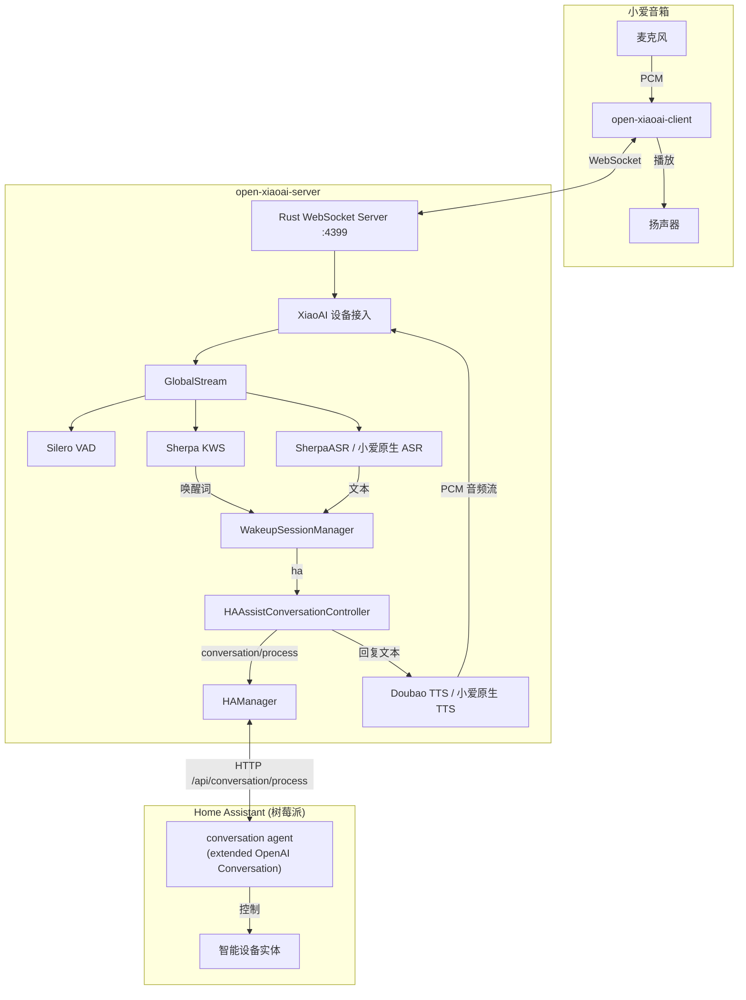

<div align="center">

# Open-XiaoAI HA Gateway

**小爱音箱 → Home Assistant 的语音网关**

把小爱音箱变成 Home Assistant 的语音入口：自定义唤醒词唤醒后，语音经
ASR 转成文本发送给 HA 的 conversation agent（如 extended OpenAI
Conversation），由 HA 控制家中智能设备，回复文本再通过 TTS（小爱原生或
豆包音色）合成音频流推给小爱播放。

本项目由 [open-xiaoai-bridge](https://github.com/coderzc/open-xiaoai-bridge)
精简改造而来：移除了小智 AI、OpenClaw、OpenAI 兼容服务、QwenPaw 等多后端
接入，只保留语音链路与 Home Assistant 对接。

</div>

---

## ✨ 功能一览

| 功能 | 说明 |
|------|------|
| 🎙️ 自定义唤醒词 | KWS 本地关键词唤醒，中英文均可 |
| 🧠 多 Agent 路由 | 不同唤醒词路由到不同 HA conversation agent，上下文互相隔离 |
| 💬 连续对话 | 一次唤醒内多轮对话，HA 的 `continue_conversation` 驱动保持监听 |
| ⚡ VAD + KWS | Silero VAD 语音活动检测 + Sherpa KWS 关键词唤醒 |
| 🗣️ TTS 音色 | 小爱原生 TTS 或豆包 TTS（多音色），可按 agent 指定音色 |
| 🏠 家居控制 | 通过 HA Assist 自然语言控制家中所有已暴露实体 |
| 🌐 HTTP API | 远程播放文本/音频、唤醒、中断（可选） |

---

## 🚀 快速开始

> ⚠️ 本项目仅包含服务端，需要先在小爱音箱上安装 Client 端。

### 📦 前置步骤

1. **刷机** — 更新小爱音箱固件，开启 SSH：
   [刷机教程](https://github.com/idootop/open-xiaoai/blob/main/docs/flash.md)
2. **安装 Client** — 在音箱上运行 Rust Client 端（转发麦克风音频流到
   服务端、接收播放指令）：
   [安装教程](https://github.com/idootop/open-xiaoai/blob/main/packages/client-rust/README.md)
3. **准备 Home Assistant** — 安装并配置
   [extended OpenAI Conversation](https://github.com/jekalmin/extended_openai_conversation)
   等 conversation agent，暴露需要控制的实体；在「设置 → 安全 → 长期访问
   令牌」创建 Long-Lived Access Token。

### 📥 模型文件

`core/models/` 目录需要以下文件（模型已 gitignore，不打进 Docker 镜像，
通过挂载提供）：

```
core/models/
├── silero_vad.onnx                  # VAD 语音活动检测（必需）
├── encoder.onnx                     # KWS 唤醒词模型（必需）
├── decoder.onnx
├── joiner.onnx
├── tokens.txt
├── bpe.model                        # 生成唤醒词表（必需）
├── keywords.txt                     # 唤醒词表（启动时自动生成）
└── sherpa-onnx-paraformer-zh-2024-03-09/   # local_asr 模式 ASR 模型（必需）
    ├── model.int8.onnx
    └── tokens.txt
```

如果 `ha.input_mode` 使用 `xiaoai_asr`（复用音箱原生识别），则不需要
Paraformer ASR 模型，但仍需要 VAD + KWS 模型。

### 🐳 Docker Compose（推荐）

仓库包含 `Dockerfile` 与 `docker-compose.yml`。由于 native 扩展通过
`path = "../../open-xiaoai-client"` 引用本地客户端源码，**构建上下文必须是
仓库上一级目录**（同时包含 `open-xiaoai-server` 与 `open-xiaoai-client`
两个目录），因此请保持如下目录结构并进入服务端目录操作：

```
code/
├── open-xiaoai-client/     # 客户端源码（构建 native 扩展时需要）
└── open-xiaoai-server/     # 服务端（含 Dockerfile / docker-compose.yml）
```

```bash
cd open-xiaoai-server

# 1. 编辑 config.py，填写 ha.base_url / ha.token（可选 ha.agent_id）
#    以及 tts.doubao.api_key

# 2. 构建并启动（首次构建需编译 Rust 扩展，耗时较长）
docker compose up -d --build

# 3. 查看日志
docker compose logs -f
```

`docker-compose.yml` 已包含配置与模型目录挂载：

```yaml
volumes:
  - ./config.py:/app/open-xiaoai-server/config.py
  - ./core/models:/app/open-xiaoai-server/core/models
```

> 💡 修改 `config.py` 后重启容器生效（服务端本身支持配置热重载，挂载文件
> 变更后会自动 reload）。

> 💡 国内镜像加速：如果构建时拉取 PyPI 依赖慢，可在 `Dockerfile` 构建阶段
> 增加 `ENV UV_DEFAULT_INDEX=https://pypi.tuna.tsinghua.edu.cn/simple`；
> Cargo 源已内置上海交大镜像（与宿主 `~/.cargo/config.toml` 一致）。

### 💻 本地编译

```bash
# 依赖: uv, Rust（Linux 还需 pkg-config, patchelf）
uv sync

# 启动（HA 默认启用）
uv run main.py

# 启用 HTTP API
API_SERVER_ENABLE=1 API_SERVER_HOST=0.0.0.0 uv run main.py
```

### ⚙️ 环境变量

| 变量 | 说明 | 默认值 |
|------|------|--------|
| `HA_ENABLE` | 启用 Home Assistant 集成 | `1` |
| `API_SERVER_ENABLE` | 启用 HTTP API | 禁用 |
| `API_SERVER_HOST` / `API_SERVER_PORT` | API 监听地址 / 端口 | `127.0.0.1` / `9092` |
| `AUDIO_INPUT_ENABLE` | 启用音频输入（KWS/local_asr 需要） | `1` |
| `OPEN_XIAOAI_TOKEN` | Client 鉴权 token（与音箱端一致） | 不鉴权 |
| `CONFIG_PATH` | 自定义 config.py 路径 | `./config.py` |
| `LOGLEVEL` | 日志级别 | `INFO` |

---

## 🏗️ 系统架构



### 数据流

**唤醒与连续对话**

```
唤醒词 → KWS → WakeupSessionManager → before_wakeup()（按关键词路由 agent）
→ 连续对话循环：VAD 检测语音 → ASR 转文本 → HA conversation/process
→ 回复文本 → TTS（豆包/小爱音色）→ PCM 音频流 → 小爱播放
→ continue_conversation=true 则继续监听 → 退出词/超时/打断结束
```

**远程控制**

```
curl POST /api/play/text → API Server → SpeakerManager → 小爱播放
```

---

## 🔌 Home Assistant 配置

在 `config.py` 的 `"ha"` 段配置：

```python
APP_CONFIG = {
    "ha": {
        "base_url": "http://homeassistant.local:8123",  # HA 地址（或局域网 IP）
        "token": "你的 Long-Lived Access Token",
        "agent_id": "conversation.extended_openai_conversation",  # 留空用默认
        "conversation_id": "",
        "language": "",
        "input_mode": "local_asr",  # 或 "xiaoai_asr"
        "exit_keywords": ["退出", "停止", "再见", "没事了", "不打扰了", "退下吧", "先这样吧", "拜拜", "没叫你"],
        "response_timeout": 60,
        "listen_settle_seconds": 0.3,  # 回答播完后的残响吸收窗，越小响应越快
        "tts_speaker": "zh_male_liangsangmengzai_uranus_bigtts",  # 或 "xiaoai"
        "session_tts_speakers": {
            "conversation.hai_mian_bao_bao": "zh_male_liangsangmengzai_uranus_bigtts",
            "conversation.pai_da_xing": "zh_female_vv_uranus_bigtts",
        },
        "rule_prompt": "注意：将结果处理成纯文字版，不要返回任何 markdown 格式，也不要包含任何代码块，并将字数控制在100字以内",
    },
}
```

### 获取 agent_id

`conversation/process` 支持 `agent_id` 指定对话 agent。extended OpenAI
Conversation 的每个配置实例会注册一个 conversation 实体，agent_id 就是该
实体 ID（形如 `conversation.extended_openai_conversation` 或带序号），可在
HA「开发者工具 → 动作 → conversation.process」里查询。

### 多 Agent 路由

不同唤醒词可路由到不同的 HA conversation agent，每个 agent 的
`conversation_id`（多轮上下文）独立保存。配置方式：在 config.py 顶部的
`AGENT_ROUTES` 建立「唤醒词 → agent_id」映射，`before_wakeup` 命中后调用
`app.set_ha_agent_id(...)` 切换会话：

```python
AGENT_ROUTES = {
    "海绵宝宝": "conversation.hai_mian_bao_bao",
    "派大星": "conversation.pai_da_xing",
}

async def before_wakeup(speaker, text, source, app):
    if source == "kws":
        from core.ha import HAManager

        for keyword, agent_id in AGENT_ROUTES.items():
            if keyword in text:
                app.set_ha_agent_id(agent_id)
                # 唤醒应答跟随该 agent 的 TTS 音色（session_tts_speakers）
                await HAManager.play_response_with_tts(f"{keyword}来了")
                return "ha"

        # 未匹配的唤醒词：仍进入 HA 连续对话（默认 agent）
        await HAManager.play_response_with_tts("来了")
        return "ha"
```

唤醒词列表需同时维护在 `wakeup.keywords` 中；修改后需重新生成 keywords.txt
并重启服务端（或使用启动脚本自动生成）。

### TTS 音色

- `tts_speaker: "xiaoai"` — 小爱原生 TTS（无需豆包凭证）
- `tts_speaker: "zh_male_liangsangmengzai_uranus_bigtts"` — 豆包 TTS
  （需配置 `tts.doubao.api_key`，火山引擎新版控制台 API Key）
- `session_tts_speakers` — 按 agent_id 覆盖音色，优先级最高

  ```python
  "session_tts_speakers": {
      "conversation.hai_mian_bao_bao": "zh_male_liangsangmengzai_uranus_bigtts",
      "conversation.pai_da_xing": "zh_female_vv_uranus_bigtts",
  },
  ```

  匹配规则为「包含」关系：当前会话的 agent_id 包含某个 key 即命中该音色。

完整音色列表见[火山引擎文档](https://www.volcengine.com/docs/6561/1257544?lang=zh)。

---

## 🌐 API Server

设置 `API_SERVER_ENABLE=1` 启用（Docker 中还需 `API_SERVER_HOST=0.0.0.0`），
默认端口 **9092**。

| 方法 | 路径 | 说明 |
|------|------|------|
| `POST` | `/api/play/text` | 播放文字（TTS） |
| `POST` | `/api/play/url` | 播放音频链接 |
| `POST` | `/api/play/file` | 上传并播放音频文件 |
| `POST` | `/api/tts/doubao` | 豆包 TTS 合成并播放 |
| `GET` | `/api/tts/doubao_voices` | 获取可用音色列表 |
| `POST` | `/api/wakeup` | 唤醒小爱音箱 |
| `POST` | `/api/interrupt` | 打断当前播放 |
| `GET` | `/api/status` | 获取播放状态 |
| `GET` | `/api/health` | 健康检查 |

示例：

```bash
# 播放文字
curl -X POST http://localhost:9092/api/play/text \
  -H "Content-Type: application/json" \
  -d '{"text": "你好，我是小爱同学"}'

# 豆包 TTS（可指定音色）
curl -X POST http://localhost:9092/api/tts/doubao \
  -H "Content-Type: application/json" \
  -d '{"text": "你好", "speaker_id": "zh_female_vv_uranus_bigtts"}'
```

---

## 🐳 Docker 常见问题

### 为什么构建上下文是上级目录？

服务端的 native 扩展（Rust）通过 `path = "../../open-xiaoai-client"` 引用
本地客户端源码。若只以上级 `open-xiaoai-server` 为构建上下文，构建会因
找不到 `open-xiaoai-client` 而失败。保持两个目录同级，并让
`docker-compose.yml` 的 `build.context` 指向上级目录即可（已配置好）。

### 容器需要声卡/麦克风吗？

不需要。服务端通过 GlobalStream（纯 Python 实现）直接消费音箱 Client 推来
的音频流做 VAD/KWS/ASR，不访问宿主音频设备。

### 容器如何访问 Home Assistant？

`ha.base_url` 填 HA 的局域网地址（如 `http://homeassistant.local:8123`）即可。
如果 HA 就跑在这台 Docker 宿主机上，不要用 `127.0.0.1`（容器内指向容器
自身），应填宿主局域网 IP，或在 compose 中使用 `network_mode: host`。

### 音箱连不上服务端？

确认 `4399` 端口已映射且宿主防火墙放行，音箱 Client 的 `server.txt` 填写
宿主局域网 IP + `ws://`，例如 `ws://192.168.x.x:4399`。

### 构建很慢 / 网络超时（尤其国内网络）？

- **基础镜像拉取失败**（如 `docker.io/library/python:3.12-slim` 超时）：
  先配置 Docker 镜像加速器并重启 Docker：

  ```bash
  sudo tee /etc/docker/daemon.json <<'EOF'
  {
    "registry-mirrors": ["https://docker.m.daocloud.io", "https://docker.1ms.run"]
  }
  EOF
  sudo systemctl restart docker
  ```

  或者不改系统配置，直接用 build-arg 换镜像源构建：

  ```bash
  docker compose build \
    --build-arg BASE_IMAGE=docker.m.daocloud.io/library/python:3.12-slim \
    --build-arg UV_DEFAULT_INDEX=https://pypi.tuna.tsinghua.edu.cn/simple \
    --build-arg PIP_INDEX_URL=https://pypi.tuna.tsinghua.edu.cn/simple
  docker compose up -d
  ```

- Cargo 源已内置上海交大镜像，正常不需要额外配置；
- apt 源已内置清华 Debian 镜像（可用 `--build-arg APT_MIRROR=deb.debian.org`
  关闭）；
- Rust 工具链下载慢可加 `--build-arg RUSTUP_DIST_SERVER=https://rsproxy.cn`；
- Rust 扩展首次编译需几分钟，属正常现象，耐心等待或加 `--progress=plain`
  查看进度。

**构建进程被杀死（exit code 137）？** 这是 OOM（内存不足）被内核杀掉，
通常是虚拟机内存太小。建议给构建环境 4GB 以上内存（或加大 swap），
构建期间不要同时跑其他占用内存的程序。

---

## ❓ 常见问题

### 唤醒词没反应？

- 启动后需等待模型加载（KWS + Paraformer 首次加载约数秒）；
- 若自定义唤醒词识别距离近，可调大 `audio_input.gain`（仅作用于 KWS 链路）
  或调低 `kws.keywords_threshold`；
- 英文唤醒词用空格分隔（如 `"open ai"`）；
- 建议使用与「小爱同学」不同的自定义唤醒词，避免与原生唤醒冲突。

### 对话需要 ASR 模型吗？

- `input_mode: "local_asr"` 需要 Paraformer 模型
  （`sherpa-onnx-paraformer-zh-2024-03-09/`）；
- `input_mode: "xiaoai_asr"` 复用音箱原生识别，无需本地 ASR 模型
  （仍需 VAD + KWS 模型）。

### 说话没说完 AI 就开始回复？

调大 `vad.min_silence_duration`（毫秒）：

```python
APP_CONFIG = {
    "vad": {
        "min_silence_duration": 1000,
    },
}
```

### 怎么让 HA 回复的音色更好听？

配置豆包 TTS 并将 `tts_speaker` 设为对应音色 ID，例如
`zh_female_vv_uranus_bigtts`。完整音色列表见
[火山引擎文档](https://www.volcengine.com/docs/6561/1257544?lang=zh)。

### HA 请求超时？

云端 LLM 响应可能较慢，调大 `ha.response_timeout`（默认 60s）。

---

## 免责声明

本项目为开源技术研究项目，与小米及其关联公司不存在任何隶属、合作、授权
或背书关系。使用者应自行确认其使用行为符合适用法规、平台规则、设备厂商
政策，并自行承担由此产生的全部风险与责任。

本项目基于 [open-xiaoai-bridge](https://github.com/coderzc/open-xiaoai-bridge)
（MIT License）精简改造。感谢原项目的启发与参考。
